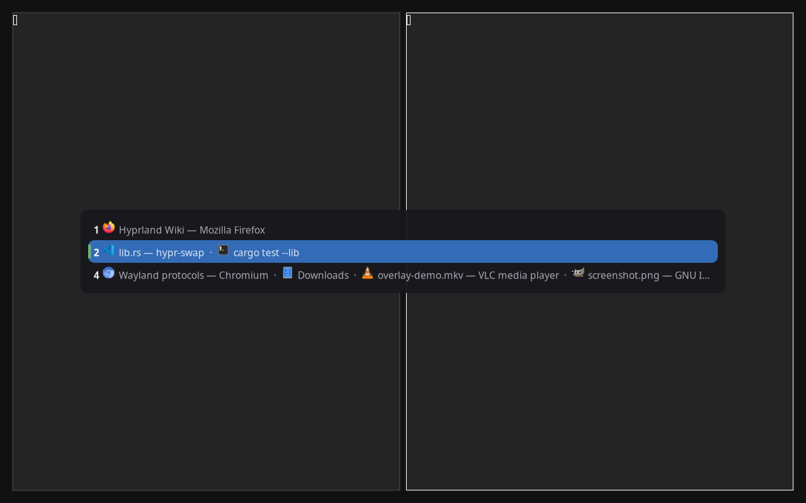
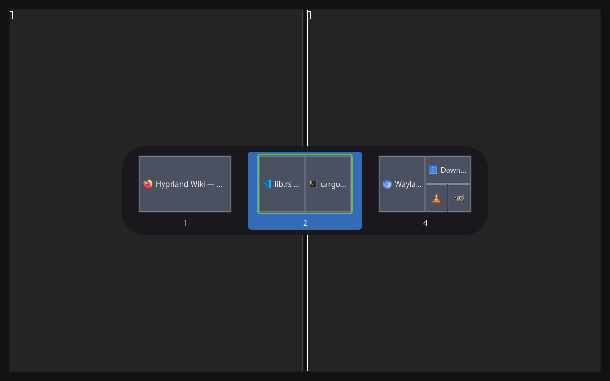

# hypr-swap

An Alt-Tab-style workspace switcher with cross-monitor swapping for
[Hyprland](https://hyprland.org/). Hold a hotkey and an overlay lists every workspace with the
windows it contains; tap to move the highlight, release to switch.



## What it is for

Switching workspaces on a multi-monitor Hyprland desktop, without losing track of where anything
is. It is a daemon you start with your session and drive from two hotkeys.

- **Hold-and-release switching** — the overlay stays up while the modifier is held and commits the
  highlighted workspace the moment you release it, like Alt-Tab for windows. One tap and release
  bounces you back to where you just were.
- **Cross-monitor swap** — selecting a workspace bound to another monitor swaps it with your
  current one: the one you were on moves there, the one you picked comes to you and becomes
  active. All-or-nothing — a partial failure is rolled back and reported.
- **Two presentations** — a flat list, or a grid of schematic miniatures showing each window's real
  position and proportion. No screen capture is involved; the miniatures are drawn from the
  compositor's own geometry.
- **Program icons** — each window carries its own program's icon, taken from your desktop's icon
  set, with a placeholder where a program can't be identified.
- **Configurable order** — most-recently-used (the default), compositor order, or grouped by
  monitor.
- **A new-workspace hotkey** — jumps to the lowest unused workspace number on the focused monitor.
- **No key grabbing** — the hotkeys are ordinary Hyprland binds delivered as named global
  shortcuts, and the in-overlay keys go through the overlay's own exclusive keyboard focus.
- **Survives compositor restarts** — reconnects with backoff, rebuilds its state and re-registers
  its shortcuts without being restarted.



## Requirements

| | |
|---|---|
| Compositor | Hyprland `>= 0.55`, on Wayland |
| System libraries | cairo, pango, pangocairo |
| To build from source | Rust `1.96` or newer |

Two optional dependencies, each of which only costs you the thing it provides:

| Optional | Without it |
|---|---|
| An installed icon set (any freedesktop-layout set — Papirus, Adwaita, breeze, …) | Every window shows the built-in placeholder icon; nothing else changes |
| `notify-send`, from a desktop notification service | Problems are reported on standard error only, with no desktop notification |

## Install

Packages and a prebuilt `x86_64` binary are published on the
[releases page](https://github.com/SerafAC/hypr-swap/releases), each with a `SHA256SUMS` file to
check it against:

```bash
# Debian, Ubuntu and derivatives
sudo apt install ./hypr-swap_<version>_amd64.deb

# Fedora, RHEL and derivatives
sudo dnf install ./hypr-swap-<version>.x86_64.rpm

# Arch — from the AUR
paru -S hypr-swap
```

Or build it yourself, which is the supported path on every other architecture and distribution:

```bash
cargo build --release
sudo install -Dm755 target/release/hypr-swap /usr/local/bin/hypr-swap
```

[`docs/user/install.md`](docs/user/install.md) covers every channel, what each one installs and
where.

## Configure it

Two things: the hotkeys, which live in `hyprland.conf`, and an optional configuration file for
everything else.

### The hotkeys

```ini
exec-once = hypr-swap

# Hold ALT, tap TAB to browse, release ALT to switch
bind = ALT, TAB, global, hypr-swap:switcher
bind = SUPER, N, global, hypr-swap:new-workspace
```

The key combinations are yours to choose; the ones above are suggestions. Use `bind`, not `binde`,
and either line may be left out. `hyprctl globalshortcuts` confirms the daemon registered them.
[`docs/user/binds.md`](docs/user/binds.md) is the full reference for what each line does and why.

A modifier in the switcher bind is what makes hold-and-release work. Bound to a bare key there is
no release to commit on, so the overlay falls back to **sticky mode**: it stays open, navigation
works as usual, `Enter` commits and `Escape` cancels.

### The configuration file

Optional — with no file present the defaults below apply. It lives at
`$XDG_CONFIG_HOME/hypr-swap/config.toml`, or wherever `--config <path>` points:

```toml
presentation = "list"     # "list" | "grid"
placement    = "active"   # "active" (monitor) | "all" (monitors)
order        = "mru"      # "mru" | "compositor" | "monitor"

icons        = true       # program icons beside window names
icon_set     = "Papirus"  # any installed icon set; default: your desktop's own
theme        = "dark"     # "dark" | "light"
```

`theme` picks a built-in palette. Any part of it can be overridden individually in a `[style]`
table, which also holds the font and the overlay's dimensions:

```toml
theme = "light"

[style]
highlight        = "#c04a2f"   # one colour, on top of the light theme
font_family      = "JetBrains Mono"
text_size        = 0.85
width_fraction   = 0.95
```

Worth knowing:

- **An invalid value costs you only that value.** It is reported, that one setting falls back to
  its default, the rest of the file still applies, and the daemon keeps running. A dimension
  outside its range is *clamped* to the nearer bound rather than rejected.
- **A theme is a palette and nothing else.** Switching theme recolours the overlay and never moves
  it, so `dark` and `light` produce a surface of exactly the same size and position.
- **`icon_set` is not `theme`.** One selects a freedesktop icon set, the other an overlay palette.
  They are independent, and neither falls back to the other.
- **Visual settings are read once, at start-up.** There is no live reload — restart the daemon to
  apply a change.

[`docs/user/configuration.md`](docs/user/configuration.md) documents every setting, and
[`docs/user/styling.md`](docs/user/styling.md) is the complete catalogue of what can go under
`[style]` — eleven colours, two font values and ten dimensions, each with its accepted form, its
range and its default.

## Use it

Hold the switcher modifier and the overlay appears. While it is up:

| Key | Action |
|---|---|
| `Tab`, `Right`, `Down` | Next entry (wraps) |
| `Shift+Tab`, `Left`, `Up` | Previous entry (wraps) |
| `Escape` | Cancel |
| `Enter` | Commit (sticky mode) |

Release the modifier to switch to the highlighted workspace. If it lives on another monitor, the
two workspaces trade places. The second hotkey needs no overlay: it drops you straight onto the
lowest-numbered unused workspace on the current monitor, and does nothing if you are already on an
empty one.

Diagnostics go to standard error, which under `exec-once` means the compositor's own log. Exit
codes are `0` for success, `2` for a usage error and `3` when the compositor cannot be reached at
start-up or a second instance is already running.
[`docs/user/troubleshooting.md`](docs/user/troubleshooting.md) covers what to do when something
looks wrong.

## Scope and privacy

hypr-swap targets **Hyprland on Wayland, and nothing else**. It depends on Hyprland's own IPC
sockets and its global-shortcuts protocol, so other compositors are out of scope rather than
merely untested. It deliberately does not manage windows, does not replace your bar or launcher,
does not draw anything outside its own overlay, and has no interest in becoming a general-purpose
desktop shell.

It performs **no network access of any kind**, collects **no telemetry**, and phones nothing home.
The only things it reads are the compositor's own state over its IPC sockets, your configuration
file, and your desktop's icon files and desktop entries. Nothing it reads leaves your machine.

## Documentation

- [User guide](docs/user/) — installing, binds, configuration, appearance, icons, troubleshooting
- [`DEVELOPMENT.md`](DEVELOPMENT.md) — building, running and testing it as a developer
- [`CONTRIBUTING.md`](CONTRIBUTING.md) — how to propose a change
- [`CHANGELOG.md`](CHANGELOG.md) — what changed in each release

## Licence

MIT — see [`LICENSE`](LICENSE).
